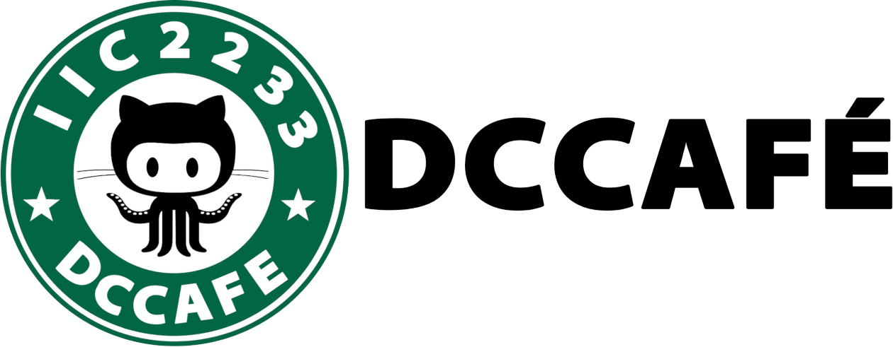

# Tarea 02: DCCafé :coffee:



- [Tarea 02: DCCafé :coffee:](#tarea-02-dccafé-️)
  - [Importante :heavy_exclamation_mark:](#importante-️)
  - [Ejecución :computer:](#ejecución-)
  - [Supuestos, aclaraciones y consideraciones :thinking:](#supuestos-aclaraciones-y-consideraciones-)
  - [Librerías :books:](#librerías-)
    - [Librerías externas utilizadas :clipboard:](#librerías-externas-utilizadas-)
    - [Librerías propias :pencil:](#librerías-propias-)
  - [Código externo utilizado :package:](#código-externo-utilizado-)
  - [Características implementadas :wrench:](#características-implementadas-)
  - [Notas adicionales :moyai:](#notas-adicionales-)

## Importante :heavy_exclamation_mark:

Cambiar los parámetros del mapa entre partidas guardadas puede causar problemas en la
ubicación del los objetos.

## Ejecución :computer:

El programa a ejecutar es **`main.py`**.

Se debe agregar los archivos `mapa.csv` y `datos.csv` y la carpeta `sprites` en el
mismo nivel que `main.py`, de modo que el directorio quede de la siguiente manera:

```txt
T02
├── backend
├── config
├── extras
├── frontend
├── sprites    <--
├── README.md
├── main.py
├── mapa.csv   <--
└── datos.csv  <--
```

Debe existir los archivos `mapa.csv` y `datos.csv` al continuar un juego, pero
pueden ser omitidos si es que solo se crean juegos.

## Supuestos, aclaraciones y consideraciones :thinking:

**El proceso que se realiza el juego es:**

1. Cada cierto tiempo se genera un cliente en una mesa desocupada aleatoria
2. El jugador interactúa con el cliente y recibe un pedido
3. El jugador interactúa con el chef para entregar un pedido
4. El chef prepara la orden que le ha sido entregada, si falla en prepararla, intenta nuevamente
5. El jugador interactúa con el chef y receive la orden preparada
6. El jugador interactúa con el cliente y le entrega la orden
7. El cliente consume la orden y se va, pagando el pedido, con la propina añadida.

**Es importante que:**

- El jugador puede tomar multiples pedidos a la vez
- Cada cliente genera un único pedido, pero puede recibir cualquier pedido
- Si cliente se retira y no ha recibido, el pedido no se elimina
- Las interacciones son con colisiones

**Las _teclas trampa_ son:**

- `M` + `O` + `Y`: aumenta el dinero
- `B` + `T` + `G`: aumenta la reputación
- `F` + `I` + `N`: cierra el café, hecha a todos los clientes y calcula la nueva reputación.

Todas estas deben ser presionadas en conjunto por lo menos un segundo.

**Los objetos tienen diferentes hit-boxes:**

- Al comprar un objeto por _drag and drop_, el hit-box es su tamaño original
- Ya dentro del juego, tienen un hit-box reducido por `reducción de hitbox` definido en `parametros.py`
- Los jugadores tienen al moverse solo la mitad inferior como hit-box

**En el menú principal hay 2 botones en la esquina superior derecha**:

- Información: Muestra información importante en la consola.
- Jugadores: número de jugadores, al presionarlo aumenta la cantidad

**Otras consideraciones del juego:**

- Los clientes tienen 4 estados en vez de 2: alegre, molesto, enojado y atendido.
- Para eliminar Chefs o Mesas en el periodo pre-ronda se debe utilizar doble-click.

**Sobre el código:**

- Utilicé `css` para añadirle estilo a las ventanas. Se encuentran en la carpeta `themes`
y son aplicados gracias a la librería propia `themes.py`.
- Gran parte de mi código está documentado con _typing_ y _docstring_.
- Existen _prints_ cuando suceden eventos que no son reflejados por el UI.

## Librerías :books:

### Librerías externas utilizadas :clipboard:

- **`PyQt`**
  - Encargada del interfaz gráfica.
- **`sys`**
  - Función `exit`.
- **`os`**
  - Función `getcwd` y el módulo `path`.
- **`math`**
  - Función `floor`.
- **`random`**
  - Funciones `random`, `randint`, `choice` y `shuffle`.
- **`functools`**
  - Función `namedtuple`.
- **`time`**
  - Función `time`.

### Librerías propias :pencil:

- **backend**
  - `game_objects.py`: clases de los objetos visuales del juego
  - `clock.py`: clase `GameClock` (los relojes del juego)
  - `game_core.py`: clase `GameCore`, _cerebro_ del programa
  - `cafe.py`: clase `Cafe`, que almacena los datos de la partida
- **frontend**
  - `initial.py`, `game.py` y `summary.py`: ventanas del juego
  - `paths.py`: clase `SpritePath`, que ayuda en la obtención de los sprites
  - `themes.py`: lee los archivos `css` y los guarda para los estilos de las ventanas
- **config**
  - `parametros`: todos los parámetros y los paths

## Código externo utilizado :package:

Usé [código de David Wallance](https://stackoverflow.com/a/48203489)
(adaptación de [la respuesta de Avaris](https://stackoverflow.com/a/14410888) en
la pregunta [PyQt4 - Drag and Drop](https://stackoverflow.com/q/14395799)
de StackOverflow) para modelar el funcionamiento del drag and drop de la tienda.

Donde usé código externo de menor extensión marqué que hace y de donde lo obtuve con `#!`.

Por ejemplo:

```python
#! Invertir un diccionario
#! https://stackoverflow.com/a/483833
clases_objects = {obj_c: name for name, obj_c in self.object_classes.items()}
```

## Características implementadas :wrench:

Se implementó todo :tada:

De los bonús:

- Presidente
- Multijugador

## Notas adicionales :moyai:

**Errores existentes:**

- Al mantener `P` se alterna entre reanudar y pausar rápidamente. Esto puede causar errores
en las animaciones.
- Algunas animaciones de Qt pueden no funcionar correctamente en un monitor adicional (Windows).
- El manejo de la memoria no es óptimo. Los objetos no se eliminan siempre del programa.
- Si entre presionar y soltar una tecla se realiza otra acción (como mover la ventana, usar drag and drop)
la tecla puede mantenerse como presionadas sin estarlo. Para arreglar esto, hay que presionar y soltar
las teclas que estaban presionadas durante la acción.

_**QThreads?**_ En el código no se usé threads ya que son poco
eficientes en la simulación de entidades (por lo menos en este tipo
de simulación). Además requieren el uso de _locks_ asociados a cada
entidad, tiempos de espera (_sleep_) e implementar un método _run_,
aumentando la complejidad del código para su funcionamiento correcto.
Para manejar las entidadesCreé una clase _GameClock<sup>TM</sup>_,
que hereda de _QTimer_, el cual utiliza el ciclo principal de thead
actual. Llegué a esa implementación por
[esta respuesta en SO](https://stackoverflow.com/a/42311174).
En comparación, la AY08 (que ocupa _QThreads_) ocupa 35% de mi CPU
con 4 entidades, mientras mi tarea ocupa como máximo 18% con
500 entidades.

**Disfrute el ~~programa~~ juego :tada:**
